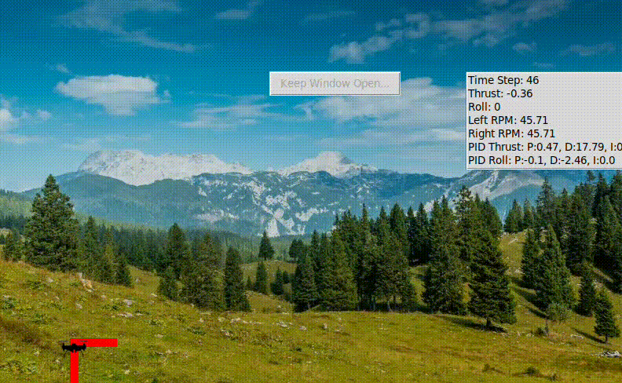
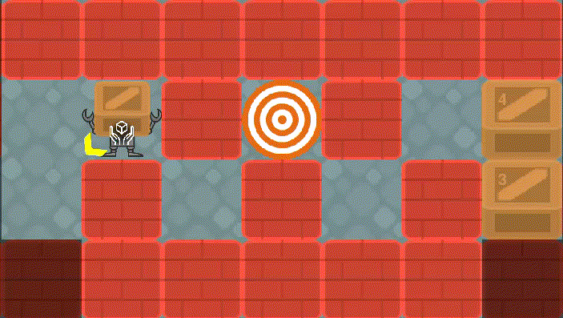
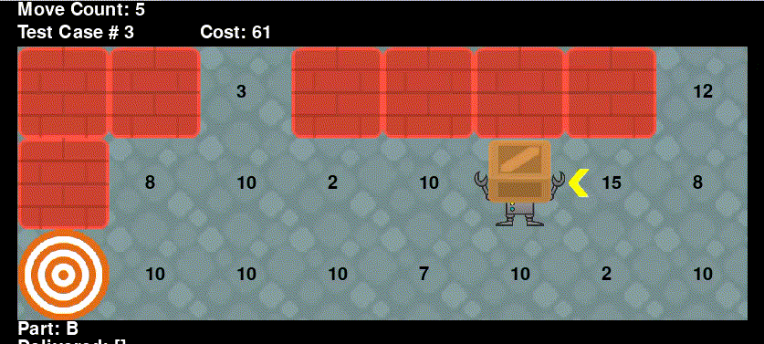
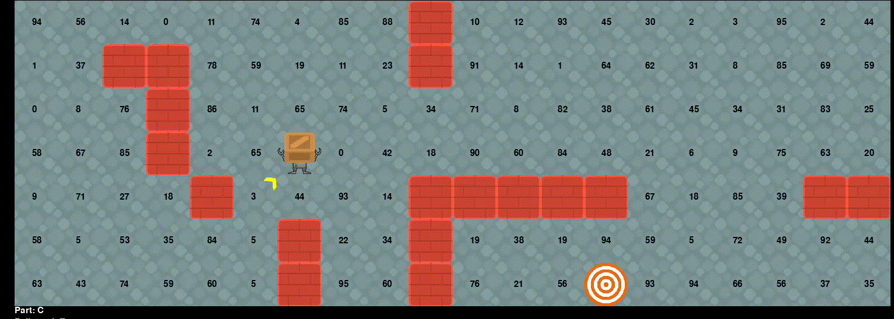
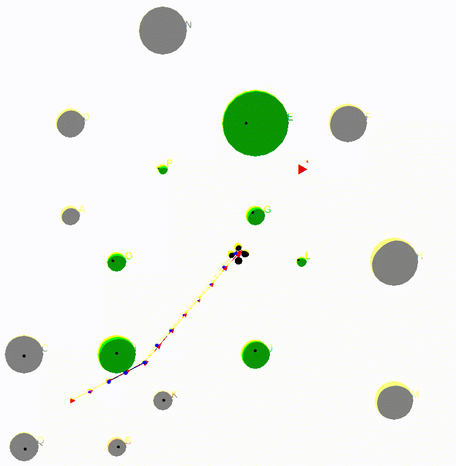

# AI Techniques for Robotics

The project combination includes the demonstration of kalman filter, particle filter, searching algorithm, PID control and SLAM algorithm.

## Kalman Filter

In this project, Earth is threatened by a shower of meteorites falling in your location. It is your task to receive
sensor readings of the locations of these meteorites, predict where each of the meteorites will be one tenth of a
second later using Kalman Filters (KFs), and finally, destroy each meteorite before it hits the ground by firing
your laser turret at it.
This project consists of two parts:
- Estimation of the positions of many meteorites given noisy measurements
- Defense: Aim and fire your laser turret at incoming meteorites before they hit the ground

We know the structure of the motion model that governs the motion of the meteorites, but each meteorite
has different coefficients in its equation of motion, which means we can’t just apply the motion model to
predict a particular meteorite’s next location. Kalman Filters allow us to combine our knowledge of the motion
model’s structure and our estimate of our uncertainty of each element in the state of a particular meteorite
with observations of the meteorite’s positions over time to predict where the meteorite will be at a future time.
Since each meteorite has its own motion model coefficients and therefore moves slightly differently than all the
other meteorites, we need one Kalman filter for each meteorite. We’ll want to create and update separate x̄s
and P s for each meteorite, using the Kalman filter equations. The state transition matrix (aka motion model
matrix, F ), measurement model matrix (H), and observation uncertainty matrix (R) are constant and the
same for all meteorites.

 

  

Estimation of meteorites locations and defense earth.

## Particle Filter

The goal of this project is to give you practice implementing a particle filter used to localize a
man-made 10.2-meter satellite in a solar system. After completing an intergalactic mission,
it’s time for you to return home. Your satellite is warped through a wormhole and released
into your home solar system in approximate circular orbit around the sun. The satellite
receives measurements of the magnitude of the collective gravitational pull of the planets in
the solar system.

  
 
(Left) Localization of satellite in a solar system; (Right) Localization of satellite in a solar system and communicate with another planet.

## PID Control

Autonomous drones are used to maintain critical infrastructure, e.g., inspect gas pipelines for leaks. In
this project you will implement a PID controller for an autonomous drone to fly to a target elevation and
horizontal position and hover at some target location for a specified time.
  

*PID control of the drone.*

## Searching Algorithms
In this project, we will implement search algorithms to navigate a robot through a warehouse to pick up and deliver boxes to a designated drop zone area with minimal costs.

  
  

*A* and Dynamic Programming algorithms for deterministic processes.*

  

*Optimal policy finding for stochastic processes.*

## SLAM
GraphSLAM operates on a straightforward principle: it deduces a collection of soft constraints from the data, forming a sparse graph. The map and robot path are then determined by resolving these constraints to achieve a globally consistent estimate. In our undertaking, online GraphSLAM is employed to guide the Indiana drones through the forest, searching for treasure while preventing collisions with trees.
  

*SLAM algorithm navigates the drone to treasure.*
